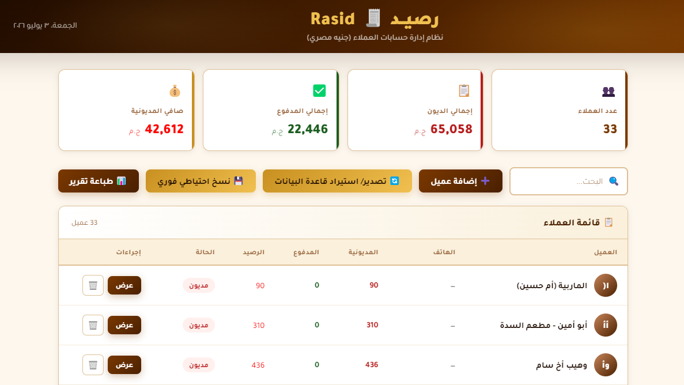
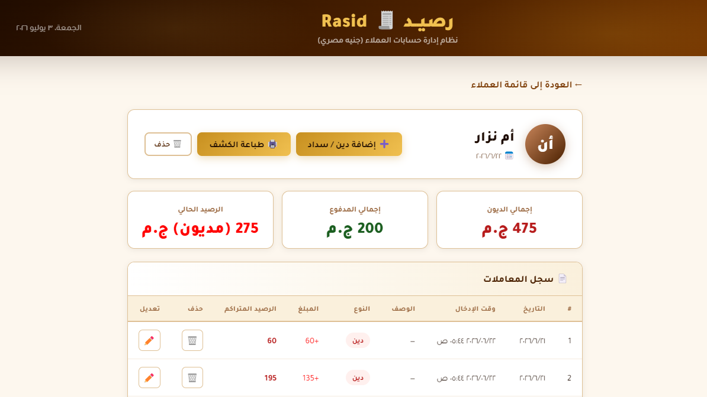
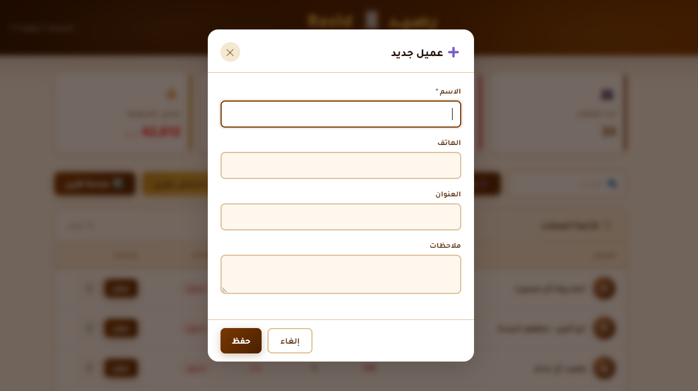
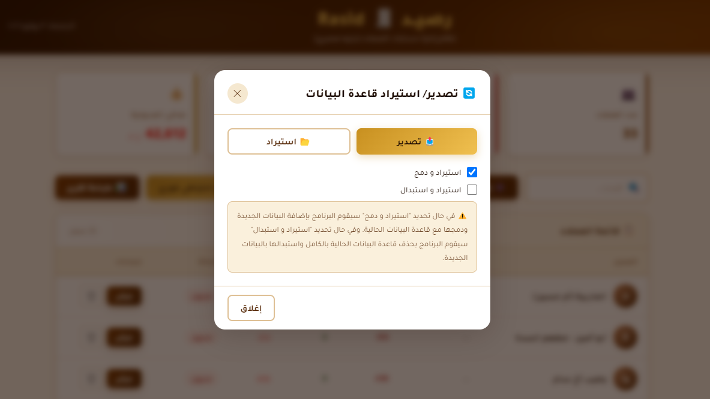
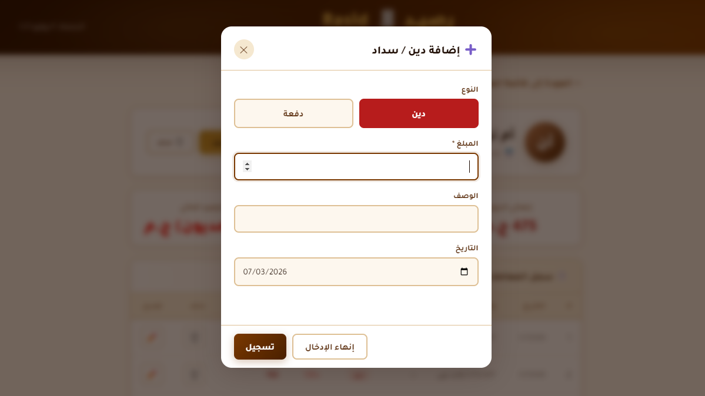
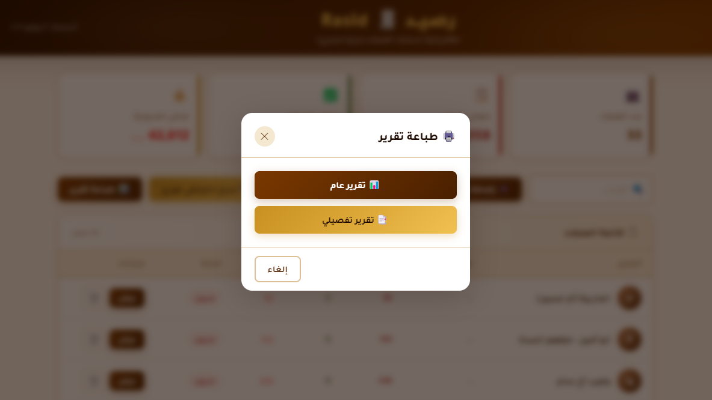

<div align="center">

# رصيــد 🧾 Rasid

**نظام إدارة حسابات العملاء**

نظام متكامل لإدارة الديون ومدفوعات العملاء للأسواق والمحلات التجارية، يعمل بالكامل كتطبيق ويب (ملف index.html) عبر المتصفح دون الحاجة إلى خادم أو إنترنت، كما يمكن بناؤه كتطبيق Windows تنفيذي (.exe) مستقل مبني بتقنيات الويب (HTML/CSS/JavaScript) ومُغلّف باستخدام **Electron** و **electron-builder**. 


[English](https://github.com/Haithamaltamemi/Rasid/blob/main/README_en.md)


</div>

---




## 📋 نظرة عامة

**رصيد Rasid** برنامج محاسبة مبسّط للمحلات والأنشطة التجارية الصغيرة، يتيح تسجيل ديون العملاء ومتابعة سداداتهم، مع إمكانية طباعة كشوف الحساب، والنسخ الاحتياطي التلقائي، وتصدير/استيراد قاعدة البيانات، صمم خصيصًا لتلبية احتياجات **محلات البقالة والأسواق التجارية والمطاعم** التي تتعامل بنظام "الذمة" أو "الحساب الجاري".

**العملة الأساسية:** الجنيه المصري (ج.م) — قابل للتغيير في الكود المصدر.

----

				
		


## أبرز المزايا

- **إدارة العملاء**: إضافة/تعديل/حذف بيانات العملاء (الاسم، الهاتف، العنوان، الملاحظات).
- **تسجيل المعاملات**: إضافة ديون ودفعات بواجهة سريعة (أزرار أفقية لاختيار النوع)، مع افتراض "دين" كقيمة أولية دائمًا.
- **سلوك ذكي لسجل المعاملات**:
  - عند السداد الكامل (الرصيد = صفر) يُمسح سجل المعاملات تلقائيًا للحفاظ على واجهة نظيفة.
  - عند السداد الجزئي، يُستبدل السجل بقيد واحد يمثل "صافي الدين المتبقي من الحساب السابق".
- **تصدير/ استيراد قاعدة البيانات**: نافذة موحّدة تدعم التصدير، والاستيراد مع خيار الدمج مع البيانات الحالية أو استبدالها بالكامل.
- **نسخ احتياطي**:
  - نسخ احتياطي **تلقائي** بعد كل تعديل (عبر Electron API أو عبر مجلد يحدده المستخدم في المتصفح).
  - نسخ احتياطي **فوري** يدوي بضغطة زر.
- **طباعة التقارير**:
  - **تقرير عام**: ملخص شامل لجميع العملاء (الديون، المدفوعات، الأرصدة).
  - **تقرير تفصيلي**: التقرير العام متبوعًا بكشف حساب كامل لكل عميل، في ملف طباعة واحد.
- **لوحة إحصائيات فورية**: عدد العملاء، إجمالي الديون، إجمالي المدفوع، صافي المديونية.
- **دعم كامل للغة العربية** واتجاه الكتابة من اليمين لليسار (RTL).

---


## 📥 التثبيت كتطبيق ويب عبر المتصفح

#### 1. تحميل الملف

احفظ ملف `index.html` في أي مجلد على جهازك، وليكن: `%USERPROFILE%\Rasid\index.html` (موصى به)

#### 2. إنشاء مجلد النسخ الاحتياطي

أنشئ مجلد النسخ الاحتياطي `Data` في نفس المسار (في المجلد الذي يحتوي على `index.html`)

> **ملاحظة:** يمكنك تسمية المجلد `Data` بأي اسم، وسيطلب منك المتصفح تحديده في أول استخدام.

#### 3. تشغيل التطبيق

انقر نقرًا مزدوجًا على ملف `index.html` لفتحه في المتصفح.

#### 4. الإعداد الأول (عند أول نسخ احتياطي)

- عند إجراء أول عملية إضافة أو تعديل، سيظهر تأكيد لتحديد مجلد `Data`.
- اضغط **"موافق"** واختر المجلد الذي أنشأته مسبقًا.
- اسمح بالوصول عند طلب المتصفح.

> **تنبيه:** لا تحذف أو تنقل مجلد `Data` بعد تحديده، وإلا ستحتاج إلى إعادة تحديده.

----


## ⚙️ بناء تطبيق Windows

قبل البدء بعملية البناء، تأكد من تثبيت [Node.js](https://nodejs.org) على جهازك (18.x أو أحدث (يتضمن npm). يمكنك التحقق من التثبيت بكتابة الأوامر التالية في موجه الأوامر:

```bash
node -v
npm -v
```


## 🚀 خطوات البناء


1. **نسخ المستودع** إلى جهازك:

   ```bash
   git clone https://github.com/Haithamaltamemi/rasid.git
   cd rasid
   ```

   

2. **تثبيت الحزم** (Electron و electron-builder):

   ```bash
   npm install
   ```

   

3. **تشغيل التطبيق في وضع التطوير**:

   ```bash
   npm start
   ```


4. **بناء تطبيق Windows:**

```bash
npm run build
```

يقوم هذا الأمر بتشغيل **electron-builder** الذي:

1. يحزم `index.html` و`main.js` و`preload.js` وباقي الملفات داخل حزمة Electron.
2. يستخدم `Icon.ico` كأيقونة للتطبيق والملف التنفيذي.
3. ينتج ملف تثبيت (Installer) أو نسخة محمولة (Portable) حسب إعدادات `build` داخل `package.json`.


بعد اكتمال البناء بنجاح، ستجد المخرجات عادةً داخل مجلد:

```
Rasid App/dist/
```

ويشمل ذلك ملف `.exe` (مثبّت أو نسخة محمولة حسب الإعداد)، بالإضافة إلى ملفات مساعدة (مثل `latest.yml` في حال تفعيل التحديث التلقائي).

> إذا كان `package.json` يحدد مسار إخراج مختلف (`"directories": { "output": "..." }`)، فسيكون الملف الناتج في المسار المحدد هناك بدلاً من `dist/`.

---


## 💾 النسخ الاحتياطي و تخزين البيانات
- عند تشغيل تطبيق سطح مكتب (Electron) النهائي، يتم استخراج ملفات التطبيق وتثبيتها إلى المسار:

```bash
%USERPROFILE%\AppData\Local\Programs\Rasid
```

- يتم حفظ قاعدة البيانات (`localStorage`) في مجلد محمي خاص بالتطبيق.
- يتم حفظ نسخة احتياطية **تلقائيًا** بعد كل عملية تعديل كملف `JSON`  في مجلد بيانات التطبيق:

```bash
%appdata%\Rasid\backups
```

- **عند إغلاق التطبيق** يتم أخذ حفظ نسخة احتياطية أخيرة تلقائيًا لضمان حفظ جميع البيانات.
- يمكن تشغيل نسخة احتياطية فورية يدويًا من واجهة التطبيق.
- يمكن **تصدير** قاعدة البيانات كملف `.json` واستيرادها لاحقًا (بخيار الدمج أو الاستبدال الكامل).

------


## 🖨️ الطباعة

يوفر التطبيق ميزة "**طباعة تقرير**" بخيارين:

- **تقرير عام**: جدول إجمالي بديون ومدفوعات وأرصدة جميع العملاء.
- **تقرير تفصيلي**: التقرير العام مضافًا إليه كشف حساب كامل لكل عميل على حدة، في ملف `pdf` واحد.

كما يمكن طباعة كشف حساب عميل واحد مباشرة من داخل صفحة تفاصيله.

---


## 🧩 التقنيات المستخدمة

- تم استخدام **HTML / CSS / JavaScript (Vanilla)** لتصميم منطق واجهة التطبيق دون أي أطر عمل خارجية (Framework-free).
- تم استخدام **Electron** لتغليف التطبيق كبرنامج سطح مكتب.
- تم استخدام **electron-builder** لبناء وتوزيع ملف `.exe` لنظام Windows.
- استخدام خط **Tajawal** (Google Fonts) للنصوص العربية (مجاني للاستخدام غير التجاري).

---


## 📝 التراخيص


- **الخطوط:** Google Fonts (Tajawal) (مجانية للاستخدام التجاري).
- **الأيقونات:** رموز Emoji قياسية.
- **الكود المصدر:** مملوك بالكامل لـ "[Haitham Altamemi](https://github.com/Haithamaltamemi)".
- **لا يسمح بإعادة التوزيع دون إذن**


## 🙏 كلمة شكر

شكرًا لاستخدامك نظام **"رصيـــد"** لإدارة حسابات عملائك. تم تصميم هذا النظام ليوفر لك تجربة سلسة وآمنة مع إمكانية استيراد بياناتك القديمة بسهولة.
📞**للتواصل:** 📧 haitham.altamemi@gmail.com

